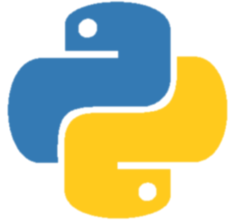

# Hi there, I'm Afeel 👋 

## I'm a Developer!!

- 🌱 I’m currently learning everything 🤣
- 🥅 2022 Goals: Learn more about mobile app development.
- ⚡ Fun fact: I love to play games.

### Languages 🧰:

 
 

---
### Tools ⚙️:

 
 

---

[instagram]: https://instagram.com/codeSTACKr
[linkedin]: https://linkedin.com/in/codeSTACKr

<h4 align="left"> GitHub Overview: </h2>
<table>
  <tr>
    <td align="center" style="padding=0;width=50%;">
      
    </td>
     <td align="center" style="padding=0;width=50%;">
      
    </td>
  </tr>
</table>

---
<h2 align="center"> Let's connect! </h2>

 &nbsp;&nbsp;
 &nbsp;&nbsp;  
 &nbsp;&nbsp; 

